# assignment-for-medical-system-database
For assignment only.

### Criteria

Given the provided attachment file (data tables) on TronClass, draw the relationships between the data tables such that they are clearly represented.

> Site: https://elearn2.fju.edu.tw/course/350088/learning-activity#/2577369
>

### ERD Chart

* The data tables are formed by using Composite Primary Key which are typically used in the following situations:
  - When a single field cannot uniquely identify a record.
  - When business logic requires multiple fields to serve together as identification criteria.
  - When there's a need to support many-to-many relationships or junction tables (like association tables).
- **Entities Using Composite Primary Keys** (9 entities):
    - Sections (`HDEPT_CODE`, `SectCode`)
    - ICDDiagnoses (`ICDH_CODEn`, `Version`)
    - ICDProcedures (`ProcedureCode`, `Version`)
    - REGCALM (`CAL_YEAR`, `CAL_MONTH`)
    - REGSCHW (`WEEK`, `NOON`, `HDEPT_CODE`, `SECT_CODE`)
    - REGSCHD (`REG_DATE`, `NOON`, `HDEPT_CODE`, `SECT_CODE`)
    - RegistrationDiagnoses (`RegistrationID`, `DiagnosisSequence`, `ICDH_CODEn`, `Version`)
    - RegistrationProcedures (`RegistrationID`, `ProcedureSequence`, `ProcedureCode`, `Version`)
    - RegistrationCharges (`RegistrationID`, `ChargeCode`)
- **Entities Using Single Primary Keys** (8 entities):
    - Departments (`HDEPT_CODE`)
    - Users (`UserID`)
    - Patients (`ChartNo`)
    - ChargeItems (`ChargeCode`)
    - PayKinds (`PayKindCode`)
    - HospitalsClinics (`ClinicCode`)
    - SpecialContracts (`SpeID`)
    - Registrations (`RegistrationID`, with additional composite unique key)

```mermaid
erDiagram
    %% ============= Lookup Tables (PascalCase) =============
    Departments {
        CHAR(2) HDeptCode PK "科別代碼"
        VARCHAR2(100) Name "科別名稱"
    }

    Sections {
        CHAR(2) HDeptCode PK "科別代碼"
        CHAR(2) SectCode PK "診別代碼"
        VARCHAR2(20) Name "科診簡稱"
    }

    Users {
        VARCHAR2(7) UserID PK "人員代號 (醫師/員工)"
        VARCHAR2(100) Name "姓名"
        VARCHAR2(20) UserType "人員類型 (Doctor, Registrar, etc.)"
    }

    Patients {
        CHAR(7) ChartNo PK "病歷號"
        VARCHAR2(100) Name "病人姓名"
        DATE DateOfBirth "出生日期"
    }

    ICDDiagnoses {
        VARCHAR2(10) ICDCode PK "診斷碼"
        VARCHAR2(5) Version PK "版本 (ICD9, ICD10)"
        VARCHAR2(255) Description "診斷描述"
    }

    ICDProcedures {
        VARCHAR2(10) ProcedureCode PK "處置/手術碼"
        VARCHAR2(10) Version PK "版本 (ICD9PCS, ICD10PCS)"
        VARCHAR2(255) Description "處置/手術描述"
    }

    ChargeItems {
        VARCHAR2(8) ChargeCode PK "收費代號"
        VARCHAR2(100) Description "收費項目描述"
        NUMBER DefaultAmount "預設金額"
        VARCHAR2(20) ChargeType "費用類型"
    }

    PayKinds {
        CHAR(2) PayKindCode PK "身份代碼"
        VARCHAR2(50) Description "身份描述"
    }

    HospitalsClinics {
        VARCHAR2(10) ClinicCode PK "院所代碼"
        VARCHAR2(100) Name "院所名稱"
    }

    SpecialContracts {
        VARCHAR2(4) SpeID PK "特約機關代碼"
        VARCHAR2(100) Name "特約機關名稱"
    }

    %% ============= Original Core Tables (SCREAMING_SNAKE_CASE) =============
    REGCALM {
        CHAR(3) CAL_YEAR PK "年 (民國年)"
        CHAR(2) CAL_MONTH PK "月"
        CHAR(31) CAL_WORK_FLAGS "日期設定 (Y:工作日 N:非工作日)"
    }

    REGSCHW {
        CHAR(1) WEEK PK "星期 (1-7)"
        CHAR(1) NOON PK "午別 (1:上 2:下 3:夜)"
        CHAR(2) HDEPT_CODE PK "科別代碼"
        CHAR(2) SECT_CODE PK "診別代碼"
        VARCHAR2(7) DOC_NO "醫師代號"
        CHAR(1) EMR_TYPE "門急診註記 (1:門 2:急)"
        VARCHAR2(8) REG_CODE "掛號費收費代號"
        VARCHAR2(8) DIAG_CODE "診察費收費代號"
        VARCHAR2(8) DIAG_GIVEN_CODE "調劑診察費代號"
        NUMBER(3) TOT_LIMIT "看診限額"
        NUMBER(3) APP_LIMIT "預約限額"
        NUMBER(3) FIRST_LIMIT "初診限額"
        CHAR(1) USE_FLAGS "是否就診號設定註記 (Y/N)"
        CHAR(200) REG_NO_FLAGS "就診號設定樣板"
        CHAR(1) USE_APP_DAYS "是否可預約天數註記 (Y/N)"
        NUMBER(2) CAN_APP_DAYS "可預約天數"
        CHAR(1) CHECK_TYPE "檢查診 (Y:不可網掛)"
        VARCHAR2(200) NOTATION "注意事項"
        VARCHAR2(1) NEED_CHART "紙本病歷調閱 (Y/N)"
        NUMBER(2) MAX_AGE "最大年齡限制"
        NUMBER(2) MIN_AGE "最小年齡限制"
    }

    REGSCHD {
        CHAR(7) REG_DATE PK "看診日期 (YYYMMDD)"
        CHAR(1) NOON PK "午別"
        CHAR(2) HDEPT_CODE PK "科別代碼"
        CHAR(2) SECT_CODE PK "診別代碼"
        VARCHAR2(7) SCHEDULED_DOC_NO "排班醫師代號"
        VARCHAR2(7) REPLACE_DOC_NO "代診醫師代號"
        CHAR(1) EMR_TYPE "門急診註記"
        CHAR(1) TRN_TYPE "重轉註記 (Y/N)"
        VARCHAR2(8) REG_CODE "掛號費收費代號"
        VARCHAR2(8) DIAG_CODE "診察費收費代號"
        VARCHAR2(8) DIAG_GIVEN_CODE "調劑診察費代號"
        CHAR(1) STOP_TYPE "停診註記 (1:正常 2:停診)"
        NUMBER(3) TOT_LIMIT "看診限額"
        NUMBER(3) APP_LIMIT "預約限額"
        NUMBER(3) FIRST_LIMIT "初診限額"
        NUMBER(3) TOT_COUNT "已掛人數"
        NUMBER(3) APP_COUNT "預約人數"
        NUMBER(3) FIRST_COUNT "初診人數"
        CHAR(200) REG_NO_FLAGS "看診號設定"
        NUMBER(2) CAN_APP_DAYS "可預約天數"
        NUMBER(3) MAX_REG_NO "最後就診號"
        CHAR(1) CHECK_TYPE "檢查診註記 (Y)"
        VARCHAR2(4) SPE_ID "預設特約機關"
        VARCHAR2(1) SHORT_STOP "暫停掛號註記 (Y)"
        VARCHAR2(1) IS_HDEPT_FIRST "科別初診註記 (Y)"
        VARCHAR2(1) NEED_CHART "紙本病歷調閱 (Y/N)"
        NUMBER(2) MAX_AGE "最大年齡限制"
        NUMBER(2) MIN_AGE "最小年齡限制"
    }

    %% ============ Decomposed Registration Tables (PascalCase) ============
    Registrations {
        BIGINT RegistrationID PK "掛號唯一識別碼 (Surrogate Key)"
        CHAR(7) REG_DATE UK "看診日期"
        CHAR(1) NOON UK "午別"
        CHAR(2) HDEPT_CODE UK "科別代碼"
        CHAR(2) SECT_CODE UK "診別代碼"
        NUMBER(3) REG_NO UK "看診號"
        CHAR(7) CHART_NO "病歷號"
        NUMBER(3) CHART_SEQ "就醫序號"
        VARCHAR2(7) ATTENDING_DOC_NO "實際看診醫師代號"
        CHAR(2) PAY_KIND1 "身份一 (主身份)"
        CHAR(2) PAY_KIND2 "身份二 (優待身份)"
        CHAR(1) FIRST_TYPE "初複診別 (1:初 2:複)"
        CHAR(1) EMR_TYPE "診別 (1:門 2:急 3:特)"
        CHAR(1) TEL_TYPE "來源別 (1:現場 2:電話)"
        CHAR(1) PER_TYPE "時段別 (1:當時段 2:非當時段)"
        CHAR(7) PROC_DATE "掛號日期"
        CHAR(4) PROC_TIME "掛號時間 (HHMM)"
        VARCHAR2(7) REGISTRAR_USER_ID "掛號人員代號"
        CHAR(1) OVERALL_CHARGE_FLAG "總繳費註記 (0:未清 1:繳清)"
        CHAR(1) OPD_STATUS "就診狀態 (1:掛號 2:看診中 3:已批價 4:轉住院)"
        VARCHAR2(1) NEED_CHART_FLAG "調病歷註記 (Y/N)"
        CHAR(7) CHART_PULL_DATE "調病歷日期"
        CHAR(4) CHART_PULL_TIME "調病歷時間"
        VARCHAR2(7) CHART_PULL_USER_ID "調病歷人員"
        CHAR(1) NEED_COUNT_FLAG "計算醫療人次註記 (Y/N)"
        CHAR(1) GO_SIGN "產婦科註記 (G/O/D/T)"
        CHAR(1) IS_DELETED "取消註記 (N:未 Y:已)"
        CHAR(7) DELETE_DATE "取消日期"
        CHAR(4) DELETE_TIME "取消時間"
        VARCHAR2(7) DELETE_USER_ID "取消人員"
        CHAR(1) OWN_CARD_FLAG "補卡碼 (N:無 Y:欠)"
        CHAR(2) CARD_NO "健保卡就醫序號"
        CHAR(2) CASE_KIND "案件分類"
        VARCHAR2(10) TURN_IN_HOSP_CODE "轉入院所代碼"
        CHAR(1) TURN_OUT_FLAG "病患是否轉出 (Y/N)"
        NUMBER(2) DRUG_DAYS "開藥日數"
        CHAR(1) GIVEN_FLAG "調劑方式 (0:自行 1:交付)"
        CHAR(1) OIN_FLAG "轉申報檔註記 (Y/N)"
        CHAR(1) MULTI_TREAT_FLAG "療程註記 (Y/N)"
        CHAR(7) LAST_TREAT_DATE "治療結束日"
        CHAR(6) CHECK_IN_TIME "診間報到時間 (HHMMSS)"
        CHAR(1) ORD_FLAG "診間註記 (Y/NULL)"
        CHAR(1) SICK_KIND "給付類別"
        VARCHAR2(7) ALT_DOC_NO1 "醫師代號1 (用途不明確)"
        CHAR(1) CONTI_FLAG "連續處方簽註記 (Y)"
        NUMBER(2) CONTI_DAYS "連續處方開藥天數"
        CHAR(1) PATIENT_LIST_FLAG "不明欄位"
        CHAR(1) ORDER_BOARD "兒科看板順序 (預設N)"
        VARCHAR2(2) IDS_CODE "周產期產檢時程"
        VARCHAR2(1) COMCARE_FLAG "共同照護註記 (Y/N)"
        VARCHAR2(1) TURN_IN_FLAG "轉診轉入註記 (Y/N)"
        VARCHAR2(1) COME_BACK_FLAG "回診註記 (I:出院 O:門診手術 NULL:否)"
        VARCHAR2(4) SPE_ID "特約機關代碼"
        VARCHAR2(1) BUY_DRUG_FLAG "藥診(自費購藥)註記"
        VARCHAR2(60) LOCATION "病歷去向"
        VARCHAR2(7) HOMECARE_USER_ID "居家照護訪視員"
        VARCHAR2(16) CHRONIC_ID "慢籤帶頭資料ID"
        VARCHAR2(7) HOMECARE_DOC_NO "居家照護訪視醫師"
        VARCHAR2(1) TRAUMA_FLAG "外傷註記"
        VARCHAR2(1) VIP_SECT "整合式照護科別"
        VARCHAR2(1) VIP_FREE "整合式照護 (1:帶頭 2:被整合 NULL:非)"
        VARCHAR2(7) REVIEW_DOC_NO "總評醫師"
        VARCHAR2(1) SIGN_FLAG "電子簽章註記"
        VARCHAR2(1) MED_FLAG "電子病歷註記"
        VARCHAR2(10) CHRONIC_HOSP_CODE "開立慢籤外院代碼"
        VARCHAR2(1) SECOND_FLAG "另掛註記 (Y)"
        VARCHAR2(1) CLOUD_DATA_FLAG "雲端註記 (Y:已下載)"
        %% UK constraint on (REG_DATE, NOON, HDEPT_CODE, SECT_CODE, REG_NO)
    }

    RegistrationDiagnoses {
        BIGINT RegistrationID PK "掛號唯一識別碼"
        INT DiagnosisSequence PK "診斷序號"
        VARCHAR2(10) ICDCode PK "診斷碼"
        VARCHAR2(5) Version PK "診斷碼版本"
        CHAR(1) DiagnosisType "類型 (P:Primary, S:Secondary)"
    }

    RegistrationProcedures {
        BIGINT RegistrationID PK "掛號唯一識別碼"
        INT ProcedureSequence PK "處置序號"
        VARCHAR2(10) ProcedureCode PK "處置碼"
        VARCHAR2(10) Version PK "處置碼版本"
        CHAR(1) ProcedureType "類型 (M:Main, S:Secondary)"
    }

    RegistrationCharges {
        BIGINT RegistrationID PK "掛號唯一識別碼"
        VARCHAR2(8) ChargeCode PK "收費代號"
        NUMBER AmountCharged "實際收費金額"
        CHAR(1) PaymentFlag "繳費註記 (Y/N)"
        CHAR(3) CopayCode "部分負擔代碼"
    }

    %% ============= Relationships =============

    %% Schedule Relationships
    REGSCHW                  ||--o{ Departments           : "參照科別"
    REGSCHW                  ||--o{ Sections              : "參照診別"
    REGSCHW                  ||--o{ Users                 : "指定醫師"
    REGSCHW                  ||--o{ ChargeItems           : "定義掛號費"
    REGSCHW                  ||--o{ ChargeItems           : "定義診察費"
    REGSCHW                  ||--o{ ChargeItems           : "定義調劑診察費"

    REGSCHD                  }o--|| REGSCHW               : "實例化自"
    REGSCHD                  ||--|| Departments           : "屬於科別"
    REGSCHD                  ||--|| Sections              : "屬於診別"
    REGSCHD                  ||--|| Users                 : "排班醫師"
    REGSCHD                  }o..|| Users                 : "代診醫師"
    REGSCHD                  ||--|| ChargeItems           : "使用掛號費"
    REGSCHD                  ||--|| ChargeItems           : "使用診察費"
    REGSCHD                  ||--|| ChargeItems           : "使用調劑診察費"
    REGSCHD                  }o..|| SpecialContracts      : "預設特約"

    %% Registration Core Relationships
    Registrations            }o--|| REGSCHD               : "屬於診次"
    Registrations            ||--|| Patients              : "掛號病患"
    Registrations            ||--|| Departments           : "掛號科別"
    Registrations            ||--|| Sections              : "掛號診別"
    Registrations            ||--|| Users                 : "看診醫師"
    Registrations            ||--|| Users                 : "掛號人員"
    Registrations            }o..|| Users                 : "調病歷人員"
    Registrations            }o..|| Users                 : "取消人員"
    Registrations            }o..|| Users                 : "其他醫師1"
    Registrations            }o..|| Users                 : "居家訪視員"
    Registrations            }o..|| Users                 : "居家醫師"
    Registrations            }o..|| Users                 : "總評醫師"
    Registrations            ||--|| PayKinds              : "主身份"
    Registrations            }o..|| PayKinds              : "優待身份"
    Registrations            }o..|| HospitalsClinics      : "轉入院所"
    Registrations            }o..|| HospitalsClinics      : "慢籤外院"
    Registrations            }o..|| SpecialContracts      : "使用特約"

    %% Registration Detail Relationships
    RegistrationDiagnoses    ||--|{ Registrations         : "的診斷"
    RegistrationDiagnoses    ||--|| ICDDiagnoses          : "參照診斷碼"

    RegistrationProcedures   ||--|{ Registrations         : "的處置"
    RegistrationProcedures   ||--|| ICDProcedures         : "參照處置碼"

    RegistrationCharges      ||--|{ Registrations         : "的收費"
    RegistrationCharges      ||--|| ChargeItems           : "參照收費項"

    %% Lookup Table Relationships
    Sections                 ||--|| Departments           : "屬於科別"
```

